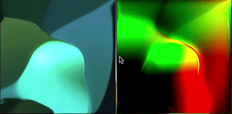

# Unity Fluid GPU

This project is a GPU based implementation of a 2D fluid solver within Unity.

## Reference Material

This project is based on the work of **Jos Stam** on interactive fluid dynamics and the [Fast Fluid Dynamics Simulation on the GPU](http://developer.download.nvidia.com/books/HTML/gpugems/gpugems_ch38.html) article.

## Structure

The simulation essentially makes use of 3 components:
- `FluidGPU` is the main component running the simulation, it is responsible for performing the various operations involved in a fluid simulation (advect, diffuse, boundary conditions)
- `PoissonSolver` is a component solely responsible for solving Poisson Equations using the Jacobi method. It is used by `FluidGPU` to solve velocity diffusion and pressure.
- `Source` is a component responsible for perturbating the fluid, using either the user's mouse or a procedural motion.

As the simulation runs on the GPU, you'll find numerical methods corresponding to each fluid update step implemented using shaders in the **Assets/Shaders** directory.

*Please, do not hesitate to comment this work. It is intended as an educational project, and criticism is welcome.*
